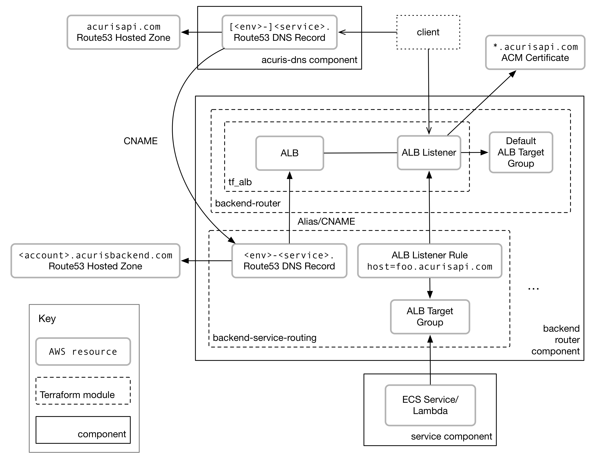

Description
===========

[](https://travis-ci.org/mergermarket/terraform-acuris-backend-service-routing)

This module creates the DNS and routing rule for a backend service. It's an opinionated module that forms the DNS name from the `env` (environment name), `name` (short name for the service - typically with the "-service" suffix removed) and `domain`.

For the live environment this will be:

```plain
    name.domain
```

For the non-live environments this will be:

```plain
    env-name.domain
```

This is intended for use in a backend router component e.g. one using <https://github.com/mergermarket/terraform-acuris-backend-router>.

Usage
-----

Add this to the bottom of the `infra/main.tf` file in your backend router for each service:

```hcl
module "cognito_service" {
    source  = "mergermarket/backend-service-routing/acuris"
    version = "0.0.2"

    env              = "${var.env}"
    component_name   = "cognito-service"
    dns_domain       = "${var.dns_domain}"
    priority         = "10"
    alb_listener_arn = "${module.backend_router.alb_listener_arn}"
    alb_dns_name     = "${module.backend_router.alb_dns_name}"
    vpc_id           = "${var.platform_config["vpc"]}"
}
```

Then put the ARN for the target group of your service in each environment into `config/qa.json`, `config/aslive.json`, ...:

```json
    {
        "target_groups": {
            "notifications-profile-matching-service": "arn:of:the:qa:notifications-profile-matching-service:target:group"
        }
    }
```

Architecture
------------

This module is the `backend-service-routing` box in the diagram below:


